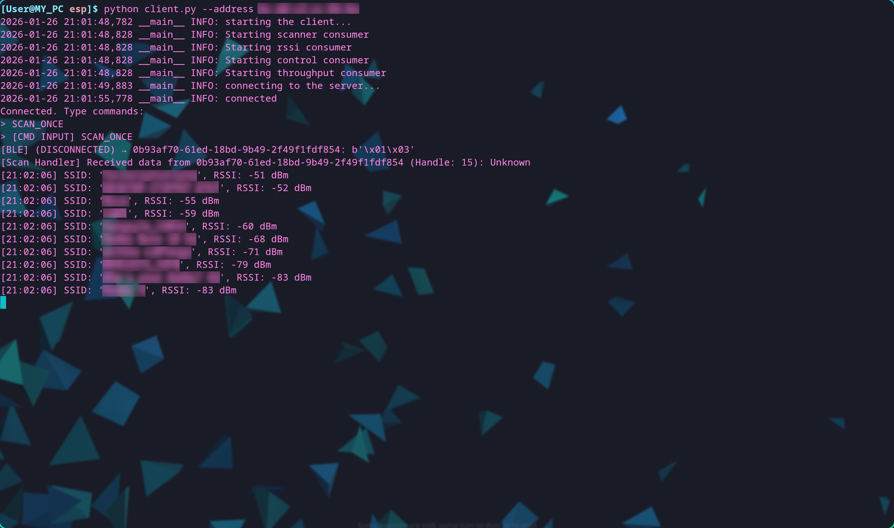
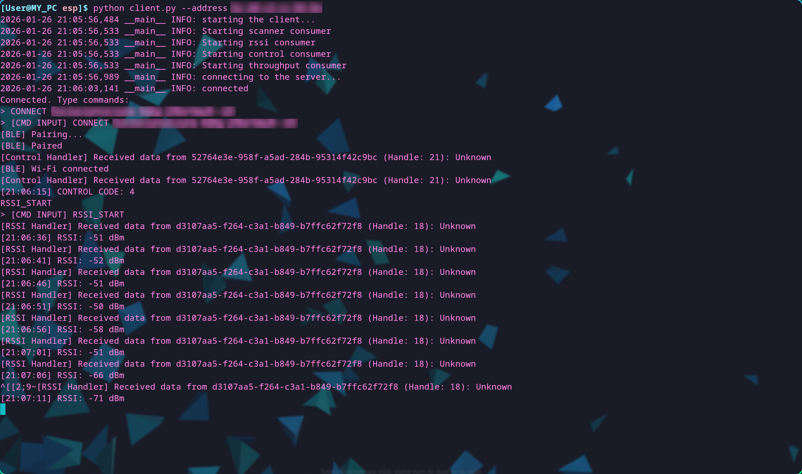

# WiFi Signal Quality Measurement System
## 1. Description
This is an ESP32-based Wi-Fi signal quality measurement system.  
It consists of an ESP32 probe server and a client that runs on a Linux machine.  
Created by [ErmalinskiMaksim](https://github.com/ErmalinskiMaksim) and [sav4it](https://github.com/sav4it)
## 2. What can the system do?
The system is capable of performing the following operations:  
* Take a single snapshot of 10 visible Wi-Fi networks and print their SSID and RSSI
* Enter a continuous Wi-Fi scanning. Takes single snapshot each ~6 seconds
* Connect (and disconnect) ESP probe to a chosen Wi-Fi network
* Gather a single RSSI value of a chosen network
* Enter a continuous RSSI gathering mode
* Measure TCP/UDP link throughput of a chosen network

## 3. Build 
### 3.1 Station (client)
***Station/*** contains a python client. It uses [Bleak library](https://github.com/hbldh/bleak)\
At the moment, the client is tested only on a Linux machine. Though, Bleak is a cross-platform library and, in theory, the code should run on the rest of the popular platforms (given all the necessary drivers are installed).  
Runs out of the box.
### 3.2 ESP32 Probe (server)
***Probe/*** contains the esp32 probe code. Originally, the code was built and tested on ESP-WROOM32 but any board should work if it supports:
* NimBLE 
* Wi-Fi

The code was built using Espressif's ***ESP-IDF*** pipeline. It depends on default ESP32 libraries and ***FreeRTOS***.
The _server_ directory contains the code that must be flashed to an ESP32 board.
To build with ESP-IDF use the following command:
``` cd Probe```
``` idf.py build```
For more info on using ESP-IDF visit their [dedicated guide](https://docs.espressif.com/projects/esp-idf/en/stable/esp32/get-started/linux-macos-setup.html)  

## 4. User Manual
1. Connect the probe to power
2. Enable Blueooth on the Linux machine
3. Run ``` python client.py --address <MAC ADDRESS OF ESP32> ```  
4. Wait for the command prompt to appear

A list of possible commands:
``` SCAN_ONCE ``` – scans for 10 Wi-Fi networks and prints their SSID with RSSI 
``` SCAN_START ``` – start performing ```SCAN_ONCE``` with an interval of roughly 6 seconds.
``` SCAN_STOP ``` – stop continuous scanning.
``` CONNECT <SSDI> <PASSWORD> ``` - connect esp32 device to the provided Wi-Fi network. This command is **necessary** to enable **RSSI gathering and throughput** measurement. The credentials are sent via a protected link.
``` DISCONNECT ``` – disconnect from Wi-Fi.
``` RSSI_ONCE ``` – acquire the RSSI of the network, ***which the probe is connected to***.
``` RSSI_START ``` – start performing ```RSSI_ONCE``` with intervals of roughly 2 seconds.
``` RSSI_STOP ``` – stop continuous RSSI acquisition.
``` TCP_THROUGHPUT <IP> <PORT> <DURATION> ``` - start TCP throughput measurement of the network ***which both the probe and the station are connected to***. IP = address of the **station**, PORT = port which the **station** should listen to, DURATION must be in seconds. 
``` UDP_THROUGHPUT <IP> <PORT> <DURATION> ``` - same as TCP_THROUGHPUT but with UDP.
``` EXIT ``` – finish the client program. 

## 5. In case of troubles...
* If the connection abruptly ends, try restarting both the client and the server.
* If a "bad cache" error appears, try to unpair the ESP32 from the PC, forget the device, and restart Bluetooth.
* If pairing fails, try restarting the probe. 

## 6. Demos



